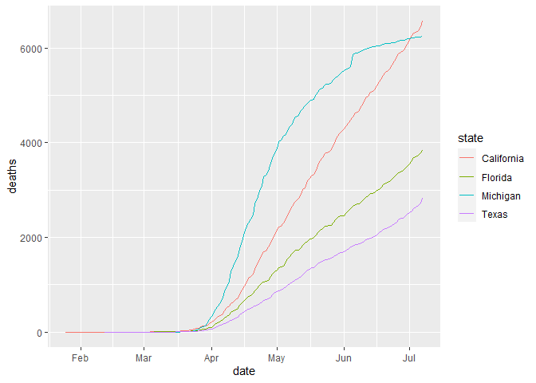
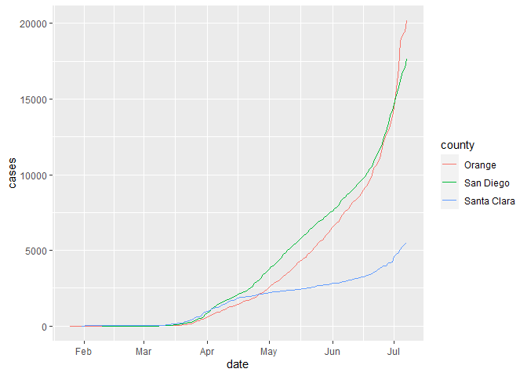

Analysis
================
Prashan A. Welipitiya
6/27/2020

``` r
#https://github.com/nytimes/covid-19-data
setwd("C:/Users/Prashan.Welipitiya/Desktop/covid-19-data")
covid_states = read.csv("us-states.csv")
covid_states$date <- ymd(covid_states$date)
covid_counties = read.csv("us-counties.csv")
covid_counties$date <- ymd(covid_counties$date)

head(covid_counties)
```

    ##         date    county      state  fips cases deaths
    ## 1 2020-01-21 Snohomish Washington 53061     1      0
    ## 2 2020-01-22 Snohomish Washington 53061     1      0
    ## 3 2020-01-23 Snohomish Washington 53061     1      0
    ## 4 2020-01-24      Cook   Illinois 17031     1      0
    ## 5 2020-01-24 Snohomish Washington 53061     1      0
    ## 6 2020-01-25    Orange California  6059     1      0

``` r
covid_hot <- covid_states %>%
filter(state == "California" | state == "Georgia" | state == "Florida" | state == "Louisiana")
ggplot(covid_hot, aes(x=date, y=deaths, color = state)) + geom_line()
```

<!-- -->

``` r
#CA_counties = filter(covid_counties, state == "California") 
CA_counties = filter(covid_counties, state == "California")
CA_counties = filter(CA_counties, county == "Santa Clara"| county == "Orange" | county == "San Diego")
ggplot(CA_counties, aes(x=date, y=cases, color = county)) + geom_line()
```

<!-- -->
